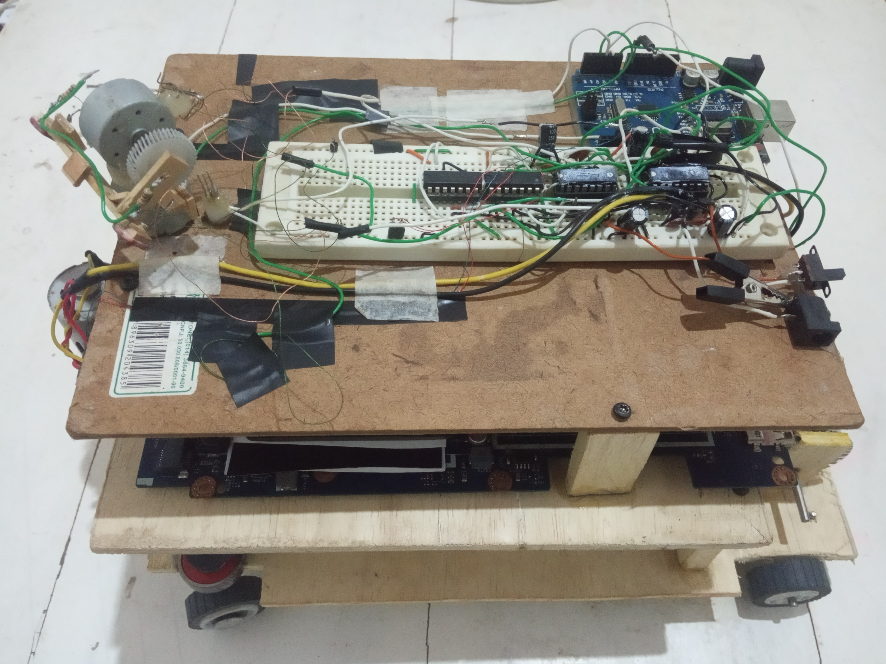

## Diagnostic_Repair_Drones
Este protótipo tem por objetivo testar a aplicação do Machine Learning em um robô com rodas, para testar a viabilidade do desenvolvimento de robôs autônomos de diagnóstico e manutenções.

### Tecnologia
Aqui estão as tecnologias utilizadas neste projeto.

* Python 3
* C++ (Arduino)
* Machine learning
* Arduino (Microcontrolador)
* TensorFlow
* pyserial 3.5 - PyPI
* lubuntu-20.10-desktop-amd64

### Serviços Usados
* Github
* PyCharm Community Edition
* Arduino IDE

### Plataforma compatíveis
* Windows

### Situação do Projeto
Projeto de software e hardware ainda em desenvolvimento.

### Links
* [Repository](https://github.com/AlainMota9/Diagnostic_Repair_Drones/)
* [Facebook](https://www.facebook.com/alain.mota.3/)
* [Lattes](http://lattes.cnpq.br/9940114103826916)
* [linkedin](https://www.linkedin.com/in/alain-mota-a61319117/)

### Controle de versão
1.0.0.0

### Autor
Alain L. Mota: [@AlainMota](https://github.com/AlainMota9)

#### Obrigado pela Visita!

